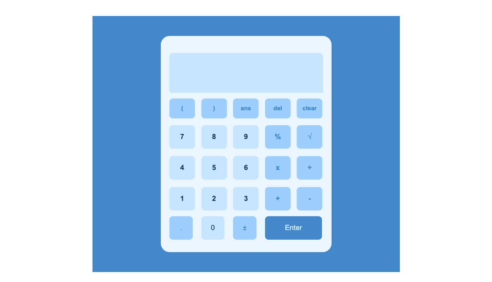

# calculatorApp


## Table of contents

- [Overview](#overview)
  - [The challenge](#the-challenge)
  - [Screenshot](#screenshot)
  - [Links](#links)
- [My process](#my-process)
  - [Built with](#built-with)
  - [What I learned](#what-i-learned)
  - [Continued development](#continued-development)
  - [Useful resources](#useful-resources)
- [Author](#author)


## Overview

This is a calculator app. It's used for basic mathematical calculations.
### The challenge

Users should be able to:

- Perform basic functions such as addition, subtraction, division, and multiplication

### Screenshot




### Links


## My process

### Built with

- Semantic HTML5 markup
- CSS custom properties
- Flexbox
- CSS Grid
- JavaScript


### What I learned

I learnt alot in the use of JavaScript for this project. I got to use methods such as replace to find and replace parts of string based on a specific regex.

To see how you can add code snippets, see below:

```html
<button class="symbols-cmd key" data-value="ans">ans</button>
```
```css
.digits{
    background-color: #cbe5fd;
    color: #1a3c62;
}
```
```js
const deleteEntry = () => {
    if(display.value){
        const entryArray = display.value.slice(0, -1);
    display.value = entryArray;
    }
}
```

### Continued development

Regex is what I would be focussing on more for future projects.


### Useful resources

- (https://developer.mozilla.org/en-US/) - This website helped with some concepts such as use of event.key in JavaScript and many others.


## Author

- LinkedIn - (https://www.linkedin.com/in/teyejohn/)
